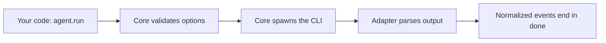

This page builds the mental model behind AnyAgent in four ideas: a unified surface that models what every harness shares, a thin core with pure adapters, capability tables that tell you what each agent supports, and a `raw` field that keeps every native detail reachable. Understand these and the rest of the API follows.

## One surface across every harness

The unified surface models the feature subset coding-agent CLIs have in common: a prompt goes in, a permission level bounds what the agent may touch, events stream out, and a final answer comes back. That shared subset is the whole surface. It never widens to fit one harness.

That has a direct consequence for your code. Anything written against the surface runs on every adapter unchanged, because no adapter has a special option the others must fake. When you ask for something a CLI cannot do, the run throws `AnyAgentError` with `code: "UnsupportedCapability"` before any process spawns, so a wrong assumption fails at the call site rather than mid-run.

## A thin core and pure adapters

The core owns every side effect. It spawns the CLI, buffers output line by line, kills abandoned processes, validates your options, and probes `PATH` during detection. An adapter never touches a child process.

An adapter is data plus two pure functions, with an optional third for CLIs whose detection deviates from the default:

- `buildInvocation(prompt, opts)` returns the exact command, arguments, environment, working directory, and stdin input to run
- `parse(source, { strict })` turns the process output into normalized events, ending in exactly one `done`
- `detect(probe)`, rarely needed, replaces the default `PATH`-and-version detection entirely

Because an adapter only maps inputs to outputs and never launches anything, it is tested offline against recorded fixtures of real CLI output, with zero subprocesses. That is also why [adding an adapter](/docs/adding-an-adapter) is a single file.

Here is one run through the split, from your call to the events you receive:



## Capability tables describe each CLI

A `CapabilityTable` is the machine-readable answer to "what does this CLI support". Read it from `agent.capabilities` or any `DetectResult`, then adapt what you ask for. Most fields guard the matching `RunOptions` field: requesting an option the table does not declare throws `UnsupportedCapability` before spawning.

```ts
const opts = agent.capabilities.modelSelection ? { model: "opus" } : {};
const result = await agent.run(prompt, opts);
```

Here the code only sets `model` when the agent declares `modelSelection`, so the same call works whether or not the CLI honors it. Two fields, `streaming` and `structuredOutput`, are informational: they describe behavior rather than guarding an option, so `runStream` works regardless of `streaming`, and structured output is reached through [escape hatches](/docs/escape-hatches). The table each CLI declares is on its [adapter page](/docs/adapters).

## Normalization keeps everything on raw

Normalization drops harness-specific detail so your code stays portable, and it keeps all of that detail reachable. Every event carries the untouched native payload on its `raw` field, and `RunResult.raw` holds the final native payload: session ids, exact cache accounting, and anything the normalized fields leave out.

Session resume is the everyday case. A harness reports its session id only in the raw payload, under its own key, so you read it there and pass it to the next run:

```ts
const first = await agent.run("Start reviewing this repo.");
const { session_id } = first.raw as { session_id?: string };

const followUp = await agent.run("Continue with src/.", { resume: session_id });
```

Each adapter page documents its raw shape, including the key its session id lives under.

## Next steps

- [Permissions](/docs/permissions): the three autonomy levels and how they map per CLI
- [Escape hatches](/docs/escape-hatches): reach native capabilities the surface does not model
- [API reference](/docs/api): every type and option
